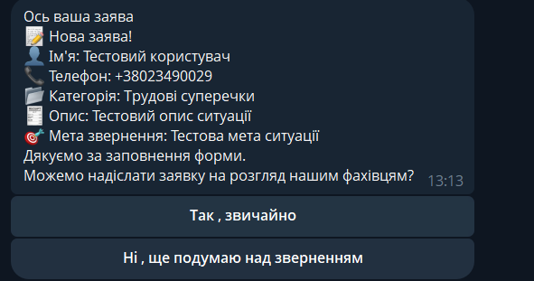
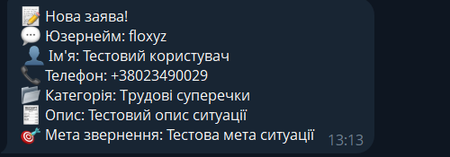

# Law Bot
Телеграм бот для зручного надання консультації із юридичних питань. Виконано на замовлення

## Скріншоти додатку
1. Форма заяви для користувача перед відправкою



2. Форма заяви в чаті у адмінів



## Стек технологій
**Функціонал** - Python + aiogram 3.13.

## Функціонал
1. Оформлення заяви до звернення
2. Перегляд детальної інформації щодо звернення адмінами 

## Локальний запуск
1. Клонувати репозиторій
```bash
git clone https://github.com/daniyilamelin/Law_Bot
```

2. Встановити всі залежності в папці проекту
```bash
pip install -r requirements.txt
```

3. Створити `.env` файл і заповнити його своїми данними
```python
BOT_TOKEN=
admins=[]
WEBHOOK_HOST=
```

4. Запустити проект
```python
python main.py
```

## Демо
[Переглянути демо проекту](https://web.telegram.org/k/#@burmystrov_law_bot)
